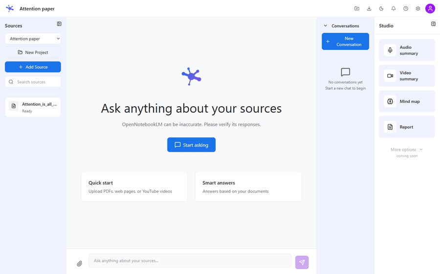
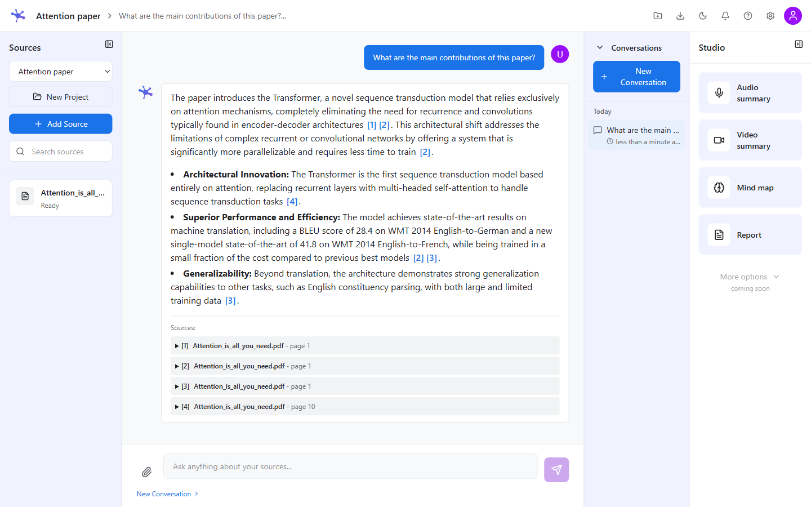
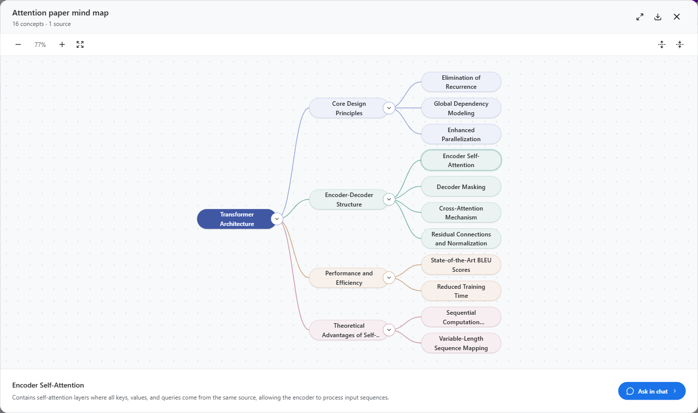
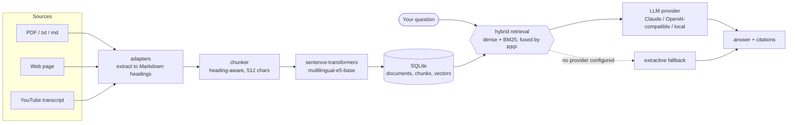

<p align="center">
  
</p>

<h1 align="center">OpenNotebookLM</h1>

<p align="center">
  <b>A self-hosted alternative to Google's NotebookLM.</b><br>
  Import your documents, ask questions about them, and get answers with citations
  back to the source — on your own machine, in your own database.
</p>

<p align="center">
  
  
  
  
  
</p>

<p align="center">
  <a href="#-quick-start">Quick start</a> ·
  <a href="#-features">Features</a> ·
  <a href="#-architecture">Architecture</a> ·
  <a href="#-configuration">Configuration</a> ·
  <a href="#-api">API</a> ·
  <a href="#-faq">FAQ</a>
</p>

<p align="center">
  
</p>

---

Documents, embeddings and conversations live in a local SQLite database. The only
thing that ever leaves your machine is the prompt sent to whichever LLM provider
you configure — and you can point that at a model running on the same machine.

## ✨ Features

| | Feature | What it does |
|---|---|---|
| 📚 | **Bring your own sources** | PDFs, `.txt` and `.md` files, web pages and YouTube transcripts, extracted into Markdown, chunked along the document's own headings, and embedded locally. |
| 🔍 | **Hybrid retrieval** | A dense vector search and a BM25 keyword search run over the same scope and are fused by reciprocal rank. The BM25 tokenizer emits CJK character bigrams, so Chinese text is searchable too. |
| 💬 | **Answers with citations** | Every answer names the chunks behind it, with the document and the section path they came from. Conversations are multi-turn and persisted per project. |
| 🔌 | **Any LLM, or none** | Claude, OpenAI, anything speaking the OpenAI chat-completions API (Groq, OpenRouter, DeepSeek, Gemini, xAI, Mistral), or a local Ollama / llama.cpp / vLLM server. |
| 🎛 | **Studio outputs** | A Markdown report, a spoken audio summary, a mind map of your sources' topics, and a narrated slideshow — all built from the same project summary. |
| 🔐 | **Per-account isolation** | Register, sign in, and every route checks ownership. Another account's project answers `404` rather than `403`, so ids cannot be enumerated. |
| 📤 | **Export anything** | One conversation, a whole project, or a project summary, as Markdown, JSON or plain text. |

## 📸 Screenshots

<!--
  Captured 2026-08-21 from a real run: Docker backend on :8000, the OpenAI-compatible
  path pointed at Groq (openai/gpt-oss-120b), and three Wikipedia pages imported
  through the app itself. Nothing here is mocked. Retake them when the workspace
  layout changes — an out-of-date screenshot is worse than none.
-->

<p align="center">
  
  <br><em>Sources on the left, the answer and the chunks it cited in the middle, Studio on the right.</em>
</p>

<p align="center">
  
  <br><em>The mind map: one branch per source, topics under each. The subtitle names the model that
  named them — or says they came from the documents' own headings, when no LLM is configured.</em>
</p>

## 🚀 Quick start

```bash
git clone https://github.com/tom1030507/OpenNotebookLM.git
cd OpenNotebookLM

cp .env.example .env          # then set JWT_SECRET_KEY and one LLM provider
docker compose up -d --build
docker compose ps
```

| | URL |
|---|---|
| Frontend | <http://localhost:3000> |
| API | <http://localhost:8000> |
| Interactive API docs | <http://localhost:8000/docs> |
| Health | <http://localhost:8000/healthz> |

Register on `/login`, create a project, drop in a PDF, and ask it something. The
first request downloads the embedding model, so expect a slow cold start.

> [!IMPORTANT]
> **With no LLM provider configured, question answering still returns a response
> — but an extractive one:** the first few sentences of the best-matching chunks,
> prefixed "Based on the provided documents". The API labels those responses
> `model_used: "fallback"`. That is the single most important thing to know
> before judging answer quality. See [Configuration](#-configuration).

## 📦 Installation

<details>
<summary><b>Docker Compose</b> — any platform (recommended)</summary>

Needs Docker 20.10+, roughly 4 GB of RAM, and 10 GB of disk for the images and
the embedding model.

```bash
cp .env.example .env
docker compose up -d --build
```

The root `docker-compose.yml` also defines optional `ollama` and `redis`
services, behind profiles:

```bash
docker compose --profile with-ollama up -d      # add a local model server
docker compose --profile with-cache up -d       # add Redis
```

`start.sh` / `start.bat` wrap the same thing: `./start.sh`, `./start.sh with-ollama`,
`./start.sh with-cache`, `./start.sh full`. Stop with `./stop.sh` or `docker compose down`.

Models are cached into the mounted `./models` volume, so recreating the container
does not re-download them.

</details>

<details>
<summary><b>Local development</b> — macOS / Linux</summary>

```bash
# Backend
cd backend
python -m venv venv
source venv/bin/activate
pip install -r requirements.txt
python -m uvicorn app.main:app --reload --port 8000
```

```bash
# Frontend, in a second terminal
cd frontend
npm ci
npm run dev
```

The database is created at `backend/data/opennotebook.db` on first run. Set
`SENTENCE_TRANSFORMERS_HOME` somewhere persistent so the embedding model is not
downloaded again per environment.

</details>

<details>
<summary><b>Local development</b> — Windows</summary>

```powershell
# Backend
cd backend
python -m venv venv
.\venv\Scripts\activate
pip install -r requirements.txt
python -m uvicorn app.main:app --reload --port 8000
```

```powershell
# Frontend, in a second terminal
cd frontend
npm ci
npm run dev
```

</details>

<details>
<summary><b>Fully offline</b> — a local model via Ollama</summary>

Nothing leaves the machine on this path.

```bash
ollama serve
ollama pull llama3.2
```

```bash
# .env
LLM_MODE=local
OLLAMA_BASE_URL=http://localhost:11434/v1
OLLAMA_MODEL=llama3.2
```

Under Docker, `docker compose --profile with-ollama up -d` brings the model
server up alongside the app; point `OLLAMA_BASE_URL` at `http://ollama:11434/v1`.

</details>

## 🏗 Architecture



A Next.js App Router frontend talks to the FastAPI backend over the same REST API
documented below; there is no privileged path around it. Routers stay thin — they
validate, delegate to a service, and shape the response.

<details>
<summary><b>How retrieval actually behaves</b>, and how a change to it is measured</summary>

Retrieval is hybrid, and both halves are needed.

The dense half alone is weak here in a way that is easy to miss. On this
project's evaluation corpus, `multilingual-e5-base` returns cosine similarities
between roughly 0.67 and 0.71 for relevant and irrelevant chunks alike — a spread
of about 0.01 between rank 1 and rank 10. Any similarity threshold inside that
band is arbitrary, which is why `RETRIEVAL_MIN_SCORE` defaults to `0` and why an
exact term match carries so much weight.

The BM25 half supplies that exactness. Its tokenizer emits Latin words and **CJK
character bigrams**, so Chinese text is searchable; splitting on whitespace, as
the previous re-ranker did, yields one token for an entire Chinese sentence and
scores zero.

Fusion ranks by the *best* reciprocal rank either retriever gave a chunk, with
the sum as the tie-break. Plain summed RRF credits a chunk simply for appearing
in both lists, and with a weak dense list that buries a keyword hit: two
questions whose answer BM25 ranked first fell out of the top ten entirely that
way.

Chunking follows the document's own structure. Extraction emits headings as
`## Heading`, the chunker keeps a heading stack so no chunk straddles a section,
and the section path is stored on the chunk, prepended to the text that gets
embedded, and shown in the citation.

**Measuring a change.** `backend/scripts/eval_retrieval.py` scores retrieval
against a fixed corpus of six Wikipedia pages (three English, three Traditional
Chinese) and 30 questions, 12 of them cross-lingual. It builds its own database
and never touches `data/opennotebook.db`:

```bash
docker exec <backend-container> sh -lc \
  "cd /app && LLM_MODE=none python -m scripts.eval_retrieval --tag mychange --out /tmp/rag-eval"
```

Ground truth is answer-bearing *text*, not chunk ids, so the same question set
stays comparable across changes to the chunker. Reports land in the `--out`
directory as `metrics.json` and `report.md`.

</details>

<details>
<summary><b>Who can read what</b> — sign-in and ownership</summary>

Development keeps registration on `/login` open through
`POST /api/auth/register`; passwords are hashed with bcrypt. Production closes
public registration unless `ALLOW_PUBLIC_REGISTRATION=true` is set. Bootstrap
an operator account without opening enrollment (the password is prompted for
without echoing it) with:

```bash
docker exec -it opennotebook-backend sh -lc \
  "cd /app && python -m scripts.create_user --username operator --email operator@example.com"
```

The command is idempotent for the same username/email. Signing in exchanges the
credentials for a bearer token at `POST /api/auth/token`. There is no way in
that skips the backend — a session it never issued is refused by every API
route.

Every route except the health checks and the two credential endpoints is mounted
behind `get_current_user`, so a request with no `Authorization` header and one
with a token the backend cannot validate both get `401`, deliberately
indistinguishable. The frontend attaches the token to every request it makes, and
on a `401` discards the local session and returns to `/login` rather than leaving
you on a workspace where each panel fails on its own.

Sign-in also mirrors the token into an `auth_token` cookie, because the Next.js
middleware that guards `/` runs on the server and cannot read `localStorage`.
That middleware only checks the cookie is *present*: it is a navigation
convenience so you land on `/login` instead of an empty workspace, and it is not
what protects your data. The API is.

Projects and documents carry an owner, and every route that reads or writes them
checks it. Conversations follow their project; retrieval is confined to the
caller's own documents even when no project is selected, so a question cannot
reach another account's chunks. A resource that belongs to someone else answers
`404`, exactly like one that does not exist — `403` would confirm the id is real,
which turns id enumeration into a way of discovering what other accounts have.

**Rows created before ownership existed have no owner, and the API treats them as
belonging to nobody rather than to everybody.** They stay in the database and
stop appearing in the UI until they are claimed:

```bash
docker exec <backend-container> sh -lc \
  "cd /app && python -m scripts.assign_owner --username <account> --dry-run"
```

Drop `--dry-run` to write. Only null owners are touched, so it is safe to re-run
and can never move a row between accounts. The `user_id` columns themselves are
added to an existing database on start-up by `db.database.ensure_added_columns`,
since `create_all` only ever creates missing *tables*.

Not scoped per account: `/api/cache/stats`, `/api/cache/health` and
`/api/cache/clear` act on one shared process-wide cache. They need a token but
not an owner, and clearing it affects everyone.

</details>

<details>
<summary><b>Project layout</b></summary>

```
OpenNotebookLM/
├── backend/
│   ├── app/
│   │   ├── routers/          # auth, projects, ingest, query, export, files, health
│   │   ├── services/         # rag, embeddings, llm, chunking, documents,
│   │   │                     # export, projects, auth, cache, document_files
│   │   ├── adapters/         # pdf, url, youtube
│   │   ├── db/               # SQLAlchemy models, session, UTCDateTime column type
│   │   ├── utils/            # logging, time
│   │   ├── api/cache.py      # cache management endpoints
│   │   ├── config.py         # settings (env-driven)
│   │   └── main.py           # app factory and router registration
│   └── tests/                # pytest; tests/unit/ holds the focused ones
├── frontend/                 # Next.js App Router
│   ├── app/                  # routes: / and /login
│   ├── components/           # workspace UI (layout/, chat/, dialogs)
│   ├── hooks/                # useMediaQuery, useDialogFocus, useDocumentStatusWatch
│   ├── lib/                  # api client, theme, session, speech, datetime
│   ├── store/                # Zustand store
│   └── middleware.ts         # session gate for /
├── deploy/                   # Dockerfile.api, docker-compose.yml, .env.example
└── docker-compose.yml        # backend, frontend, optional ollama and redis
```

</details>

## ⚙ Configuration

Set **one** LLM provider in `.env`. `LLM_MODE=auto` (the default) picks the first
one configured, in the order Claude → OpenAI → local server.

```bash
CLAUDE_API_KEY=sk-ant-...        # or
OPENAI_API_KEY=sk-...            # or
LLM_MODE=local                   # with OLLAMA_BASE_URL / OLLAMA_MODEL
```

`GET /healthz` reports which provider is *configured*; `model_used` on a
`/api/query` response tells you which one actually answered.

<details>
<summary><b>LLM providers in detail</b> — Claude, OpenAI-compatible, local</summary>

**Claude** (the default when a key is present)

```bash
CLAUDE_API_KEY=sk-ant-...
CLAUDE_MODEL=claude-opus-5      # default
CLAUDE_EFFORT=low               # low | medium | high | xhigh | max
```

Two details worth knowing:

- **Sampling parameters are not sent.** Current Claude models reject
  `temperature`, so the `temperature` argument in a query request is ignored on
  this path. Control depth with `CLAUDE_EFFORT` instead. Answering from retrieved
  chunks is not reasoning-heavy, which is why the default is `low`.
- **Thinking is on by default and shares the output budget with the answer.** A
  request's `max_tokens` is therefore raised to at least `CLAUDE_MIN_MAX_TOKENS`
  (2048) so the reply is not truncated by the thinking.

**OpenAI, or any provider that speaks its API**

```bash
OPENAI_API_KEY=sk-...
OPENAI_MODEL=gpt-5.6            # default
OPENAI_BASE_URL=                # empty for OpenAI itself
```

`OPENAI_BASE_URL` redirects this path at any service implementing the same
chat-completions API, which is most of them. Give it the provider's `/v1`
endpoint and an `OPENAI_MODEL` that provider actually serves:

| Provider | `OPENAI_BASE_URL` |
|----------|-------------------|
| Groq | `https://api.groq.com/openai/v1` |
| OpenRouter | `https://openrouter.ai/api/v1` |
| DeepSeek | `https://api.deepseek.com/v1` |
| Google Gemini | `https://generativelanguage.googleapis.com/v1beta/openai/` |
| xAI | `https://api.x.ai/v1` |
| Mistral | `https://api.mistral.ai/v1` |

Model ids differ per provider and change often — list them rather than guessing,
e.g. `curl -s $OPENAI_BASE_URL/models -H "Authorization: Bearer $KEY"`.

Note the `openai` SDK also reads an `OPENAI_BASE_URL` from the process
environment on its own, so an exported value takes effect even when this setting
is unset. Set it explicitly if you mean to reach OpenAI.

This path sends `max_tokens`. It has not been exercised against a live OpenAI key
here, and newer OpenAI models have been migrating that parameter to
`max_completion_tokens` — if a request is rejected for the parameter name, that is
the thing to change in `OpenAICompatibleProvider.generate`.

**Reasoning models return their thinking as the answer**

Groq's reasoning models (`qwen/qwen3.6-27b`, MiniMax M2.7) put their entire chain
of thought in `message.content`, wrapped in `<think>` tags — so it arrives as the
answer and the UI renders it. `OPENAI_REASONING_FORMAT=hidden` suppresses it
(`parsed` moves it to a separate field, `raw` is the provider default). Measured
on one retrieval question at the 512-token budget `services/rag.py` sends:

| `OPENAI_MODEL` | `<think>` in the answer | output tokens used |
|----------------|-------------------------|--------------------|
| `qwen/qwen3.6-27b` | yes | 373 / 512 |
| `qwen/qwen3.6-27b` + `hidden` | no | 332 / 512 |
| `llama-3.3-70b-versatile` | no | 25 / 512 |

`hidden` cleans the output but the reasoning is still generated, still billed, and
still counted against `max_tokens` — and because it comes first, hitting the
ceiling truncates the answer rather than the thinking. That is what
`OPENAI_MIN_MAX_TOKENS` (default 2048) exists to prevent: at the 512
`services/rag.py` sends, turns that reasoned for the whole budget came back cut
mid-sentence, or empty. Raise it further if answers still arrive truncated — a
five-turn conversation measured here peaked at 1915 output tokens. A
non-reasoning model is the cheaper way to a clean answer.

`OPENAI_REASONING_FORMAT` is a Groq extension, sent only when set, because OpenAI
and the others reject parameters they do not recognise. `openai/gpt-oss-*` models
are unaffected: they return reasoning in a separate field already.

**A local model** (Ollama, llama.cpp, vLLM)

```bash
LLM_MODE=local
OLLAMA_BASE_URL=http://localhost:11434/v1
OLLAMA_MODEL=llama3.2           # must match a model you have pulled
```

**Checking which provider is actually in use**

`GET /healthz` reports the configured provider and model:

```json
{ "config": { "llm_mode": "auto", "llm_provider": "claude", "llm_model": "claude-opus-5" } }
```

That says *configured*, not *reachable* — no network call is made from a health
check. To tell whether an answer was generated or extracted, read `model_used` on
the `/api/query` response: anything other than `"fallback"` is a real generated
answer. A provider that fails at call time logs the underlying error at `ERROR`
level and falls back for that request.

</details>

<details>
<summary><b>Embeddings</b> — model choice, memory cost, and re-indexing</summary>

Retrieval quality depends on the embedding model, configured by `EMB_MODEL_NAME`.
The dimension is read from the model at load time, so `EMB_DIMENSION`
self-corrects and does not need to match.

The default is `intfloat/multilingual-e5-base` (768 dimensions). The previous
default, `bge-small-en-v1.5`, was English-only.

The e5 family is trained with asymmetric prefixes — indexed text as `passage: …`,
a search string as `query: …`. `services/embeddings.py` applies them
automatically for models whose name contains `e5`, and adds nothing for models
that must not have them. If you switch to a non-e5 model, no change is needed.

**Memory is the binding constraint, not download size.** Measured in this
project's container, with the app's own imports already loaded (0.61 GB):

| Model | Peak RSS | Dimensions | Download |
|---|---|---|---|
| `intfloat/multilingual-e5-base` | 2.69 GB | 768 | ~1.1 GB |
| `BAAI/bge-m3` | 4.85 GB | 1024 | ~4.6 GB |

bge-m3 is the stronger multilingual model and needs no prefixes, but on an 8 GB
host it OOM-killed a full re-index. Use it only where the memory headroom is real.

sentence-transformers caches models under `$HOME/.cache/torch`. Docker Compose
redirects that to the mounted `./models` volume so recreating the container does
not re-download; outside Docker, set `SENTENCE_TRANSFORMERS_HOME` somewhere
persistent.

Stored vectors are only comparable to vectors produced by the same model.
**Changing `EMB_MODEL_NAME` invalidates every embedding already in the database**
— retrieval will fail on a dimension mismatch until documents are re-indexed. To
switch models:

1. Stop the backend.
2. Set the new `EMB_MODEL_NAME` in `.env`.
3. Restart, then rebuild the index in place:
   ```bash
   docker exec <backend-container> sh -lc "cd /app && python -m scripts.reindex"
   ```

`scripts/reindex.py` re-extracts, re-chunks and re-embeds every document already
in the database, keeping document ids — so projects, conversations and citations
survive, which deleting the embeddings and re-uploading by hand does not. Back up
`backend/data/opennotebook.db` first and use `--dry-run` to see what it would
touch; `--source-type` and `--ids` narrow it. A source it cannot re-read — a URL
that now 404s, a PDF whose upload is gone — is marked `error` and keeps its old
chunks, so it stops being retrievable until it is re-added.

The same script is how a change to extraction or chunking reaches documents that
are already indexed. Stored chunks were produced by the old code and do not
improve on their own.

</details>

<details>
<summary><b>Every environment variable</b>, with defaults from <code>backend/app/config.py</code></summary>

| Variable | Description | Default |
|----------|-------------|---------|
| **LLM** | | |
| `LLM_MODE` | Provider selection: `auto`, `claude`, `openai`, `local`, `none` | `auto` |
| `CLAUDE_API_KEY` | Anthropic API key | – |
| `CLAUDE_MODEL` | Claude model id | `claude-opus-5` |
| `CLAUDE_EFFORT` | Reasoning depth: `low`…`max` | `low` |
| `CLAUDE_MIN_MAX_TOKENS` | Floor for a request's output budget | `2048` |
| `OPENAI_API_KEY` | OpenAI API key | – |
| `OPENAI_MODEL` | OpenAI model id | `gpt-5.6` |
| `OPENAI_BASE_URL` | Redirect the OpenAI path at a compatible provider | – (OpenAI) |
| `OPENAI_REASONING_FORMAT` | Groq only: `parsed`, `raw`, `hidden` | – |
| `OPENAI_MIN_MAX_TOKENS` | Floor for a request's output budget | `2048` |
| `LLM_MAX_REQUEST_TOKENS` | Known per-request ceiling, to skip discovering it | – |
| `OLLAMA_BASE_URL` | Local OpenAI-compatible endpoint | `http://localhost:11434/v1` |
| `OLLAMA_MODEL` | Local model name | `llama3.2` |
| **Embedding** | | |
| `EMB_MODEL_NAME` | sentence-transformers model | `intfloat/multilingual-e5-base` |
| `EMB_DIMENSION` | Vector dimension (auto-corrected from the model) | `768` |
| `EMB_BACKEND` | Vector store backend | `sqlitevec` |
| **Retrieval & chunking** | | |
| `CHUNK_SIZE` / `CHUNK_OVERLAP` | Chunking window, in characters | `512` / `50` |
| `RETRIEVAL_TOP_K` | Chunks retrieved per question | `5` |
| `RETRIEVAL_CANDIDATE_K` | Candidates each retriever offers before fusion | `30` |
| `RETRIEVAL_MIN_SCORE` | Minimum cosine similarity for a dense candidate | `0.0` |
| `HYBRID_ENABLED` | Fuse dense and BM25 retrieval | `true` |
| `HYBRID_RRF_K` | Rank-damping constant for the fusion | `60` |
| `DEDUPE_JACCARD` | Token overlap at which two candidates are one passage | `0.9` |
| `CONTEXT_CHAR_BUDGET` | Ceiling on retrieved context in a prompt | `12000` |
| `RERANK_ENABLED` | Legacy heuristic re-ranker, used when `HYBRID_ENABLED=false` | `true` |
| **Database** | | |
| `DATABASE_URL` | SQLAlchemy URL | `sqlite:///./data/opennotebook.db` |
| **Auth** | | |
| `JWT_SECRET_KEY` | Token signing key — **required** unless `APP_ENV=development` | – |
| `JWT_ALGORITHM` | Signing algorithm | `HS256` |
| `ACCESS_TOKEN_EXPIRE_MINUTES` | Token lifetime | `720` |
| `ALLOW_PUBLIC_REGISTRATION` | Public signup; defaults on only in development | environment-dependent |
| **Uploads** | | |
| `MAX_FILE_SIZE_MB` | Upload limit | `50` |
| `ALLOWED_FILE_TYPES` | Accepted extensions | `pdf,txt,md` |
| `MAX_URL_DOWNLOAD_MB` | Decompressed URL response limit | `10` |
| `MAX_URL_REDIRECTS` | Redirects revalidated per URL import | `5` |
| `URL_CONNECT_TIMEOUT_SECONDS` | URL socket connection timeout | `5` |
| `URL_READ_TIMEOUT_SECONDS` | URL socket read timeout | `30` |
| `URL_DOWNLOAD_TIMEOUT_SECONDS` | Total URL import download cap | `30` |
| **Abuse controls** | | |
| `RATE_LIMIT_ENABLED` | Enforce in-process IP/account windows | `true` |
| `RATE_LIMIT_MAX_KEYS` | Maximum non-expired limiter buckets | `10000` |
| `TRUST_PROXY_HEADERS` | Trust `X-Forwarded-For` from an operator-controlled proxy | `false` |

Without `JWT_SECRET_KEY`, a development server signs tokens with a key generated
per process — sessions do not survive a restart. Any non-development deployment
refuses to start without it.

See [`.env.example`](./.env.example) and [`deploy/.env.example`](./deploy/.env.example).

</details>

## 🔌 API

Interactive docs at `/docs`, ReDoc at `/redoc`. Every path except `/healthz`,
`/ready` and the two `/api/auth` credential endpoints requires
`Authorization: Bearer <token>` and answers `401` without one.

<details>
<summary><b>Every endpoint</b></summary>

| Method | Path | Purpose |
|---|---|---|
| `GET` | `/healthz`, `/ready` | Liveness and readiness |
| `POST` | `/api/auth/register`, `/api/auth/token` | Create an account, exchange credentials for a token |
| `GET` | `/api/auth/me` | The account behind a bearer token |
| `GET`/`POST` | `/api/projects` | List and create projects |
| `GET`/`PUT`/`DELETE` | `/api/projects/{id}` | Read, rename, delete a project |
| `GET` | `/api/projects/{id}/documents` | Documents in a project |
| `POST` | `/api/projects/{id}/upload` | Upload a file (PDF, txt, md) |
| `POST` | `/api/projects/{id}/upload-url` | Import a web page |
| `POST` | `/api/projects/{id}/upload-youtube` | Import a YouTube transcript |
| `GET` | `/api/docs/{id}`, `/api/docs/{id}/status` | Document detail and ingest status |
| `GET` | `/api/docs/{id}/file` | The stored file, served inline (PDF preview) |
| `POST` | `/api/query` | Ask a question; returns `answer`, `sources`, `chunks_used`, `model_used` |
| `GET`/`POST` | `/api/projects/{id}/conversations` | List and create conversations |
| `GET`/`PUT`/`DELETE` | `/api/conversations/{id}` | Read, rename, delete a conversation |
| `GET` | `/api/export/conversation/{id}` | Export one conversation (markdown, json, txt) |
| `GET` | `/api/export/project/{id}` | Export a project (markdown, json) |
| `GET` | `/api/export/project/{id}/summary` | Project summary — powers Studio's report and audio |
| `GET` | `/api/projects/{id}/mindmap` | Mind map of a project; returns `root`, `node_count`, `model_used` |
| `GET` | `/api/projects/{id}/video-summary` | Scene script for Studio's video summary; returns `scenes`, `estimated_seconds`, `model_used` |
| `GET`/`DELETE` | `/api/cache/*` | Cache stats, health, clear, invalidate, warm up |

`/api/docs/{id}/file` is no exception to the bearer-token rule, which is why the
preview pane fetches a file through the API client and renders the bytes, rather
than pointing an `<iframe>` at the route.

Every datetime the API returns carries a UTC designator (`+00:00`), so clients in
any timezone render timestamps correctly.

</details>

## 🧪 Testing

```bash
# Backend — against a running container
docker exec <backend-container> sh -lc "cd /app && python -m pytest tests -q"

# or locally, if the ML dependencies are installed
cd backend && pytest -q

# Frontend
cd frontend && npm test          # vitest
cd frontend && npm run lint
```

Both suites are green on `master`. The backend suite needs the ML dependencies
(`sentence-transformers` and its transformers pin) importable — a bare virtualenv
without them cannot collect the tests.

## ⚠ Known limitations

<details>
<summary>Stated plainly, because several of these look like features until you hit them</summary>

- **There is no sharing.** Ownership is all-or-nothing: a project belongs to one
  account, and there is no way to grant another account access to it.
- **Caching is in-memory.** `app/services/cache.py` will use Redis if a client and
  a `redis_url` setting are present; neither ships, so the cache is per-process
  and resets on restart.
- **YouTube import depends on YouTube.** The pinned
  `youtube-transcript-api==0.6.1` scrapes the watch page, and YouTube rate-limits
  it — imports can fail with an XML parse error on a blocked response even though
  the code is correct.
- **Studio's video summary is not a video file.** The backend returns a scene
  script and the browser plays it as a narrated slideshow, reading the narration
  out with the Web Speech API — the same split the audio summary uses. There is
  nothing to download but the script, as Markdown. Rendering an MP4 would mean
  adding a drawing library, a speech engine and ffmpeg to the image; recording the
  slideshow in the browser is no substitute, because Web Speech output cannot be
  captured into a `MediaStream` and the file would come out silent.
- **A video summary's narration is only as good as its inputs.** With no LLM
  configured each source scene is extracted instead — heading structure first,
  then the document's opening sentences, then word frequency — and `model_used`
  says so, in the response and in the player.
- **A mind map's topics are only as good as its inputs.** With no LLM configured
  they come from the documents' own heading structure, and for a PDF with no
  headings from word frequency — useful, but a keyword list rather than a reading
  of the text. `model_used` on the response says which happened, and the dialog
  repeats it, so an extracted map is never presented as a generated one.
- **A small provider tier costs one refused request per feature.** The mind map
  and the video summary ask for as much output as the model will give, because a
  reply cut off mid-JSON parses to nothing. Providers count the prompt and
  `max_tokens` together against a rate limit — Groq's on-demand tier allows 8000 a
  minute, under which qwen3.6-27b's own 16384-token limit does not fit — so the
  first such request is refused, the ceiling is read out of the refusal, and the
  request is retried inside it. Each feature holds its own provider and so pays
  that once. Set `LLM_MAX_REQUEST_TOKENS` to skip it entirely. A project large
  enough that its prompt alone approaches the ceiling still falls back to
  extraction.
- **No WebSockets.** Ingest progress is polled, not pushed.
- **Cross-lingual retrieval is only partly there.** A question in one language
  finds passages in the other when they share a proper noun, because BM25 matches
  it. When the vocabulary does not overlap at all — an English question whose
  answer exists only in Chinese prose — `multilingual-e5-base` does not reliably
  bridge the gap. `BAAI/bge-m3` is the stronger multilingual model and would
  likely close it, but needs roughly 4.85 GB of RSS against this one's 2.69 GB.
- **Retrieval scans the whole scope on every question.** Both halves are linear in
  the number of chunks in the project; `sqlite-vec` and `faiss-cpu` are installed
  but not wired up, so `EMB_BACKEND` has no effect.

</details>

## ❓ FAQ

<details>
<summary>Why does my answer read like it was copied straight out of the document?</summary>

Because it was. No LLM provider is configured, so the answer is extractive: the
best-matching chunks, lightly stitched. Check `model_used` on the `/api/query`
response — `"fallback"` means exactly this — then set one of the keys in
[Configuration](#-configuration).

</details>

<details>
<summary>Can I run it with no cloud provider at all?</summary>

Yes. Embeddings, retrieval, storage and the whole UI are local already; the only
outbound call is generation. Point `LLM_MODE=local` at Ollama, llama.cpp or vLLM
and nothing leaves the machine.

</details>

<details>
<summary>Where is the video file for the video summary?</summary>

There isn't one. The backend returns a scene script and the browser plays it as a
narrated slideshow, speaking the narration through the Web Speech API. The
downloadable artefact is the script, as Markdown. See
[Known limitations](#-known-limitations) for why recording it in the browser
would produce a silent file.

</details>

<details>
<summary>I changed <code>EMB_MODEL_NAME</code> and retrieval broke. What now?</summary>

Stored vectors are only comparable to vectors from the same model, so the old
embeddings are now unusable and the dimensions no longer match. Re-index in
place — it keeps document ids, so projects, conversations and citations survive:

```bash
docker exec <backend-container> sh -lc "cd /app && python -m scripts.reindex"
```

</details>

<details>
<summary>Can I share a project with someone else?</summary>

Not yet. A project belongs to exactly one account, and requests from any other
account get `404`. Everyone who needs their own notebooks registers their own
account on the same instance.

</details>

## 🤝 Contributing

Issues and pull requests are welcome. [`AGENTS.md`](./AGENTS.md) documents the
conventions this repository actually follows — thin routers, services that hold
the logic, UTC-aware datetime columns, and where the live code is (`backend/app/`,
not the orphaned root-level `app/`). Read it before the first commit.

Run both test suites before opening a pull request, and keep the README honest:
if a change alters what a feature does without an LLM configured, say so here.

<p align="center">
  <a href="https://github.com/tom1030507/OpenNotebookLM/graphs/contributors">
    
  </a>
</p>

## 📄 License

[MIT](./LICENSE).
